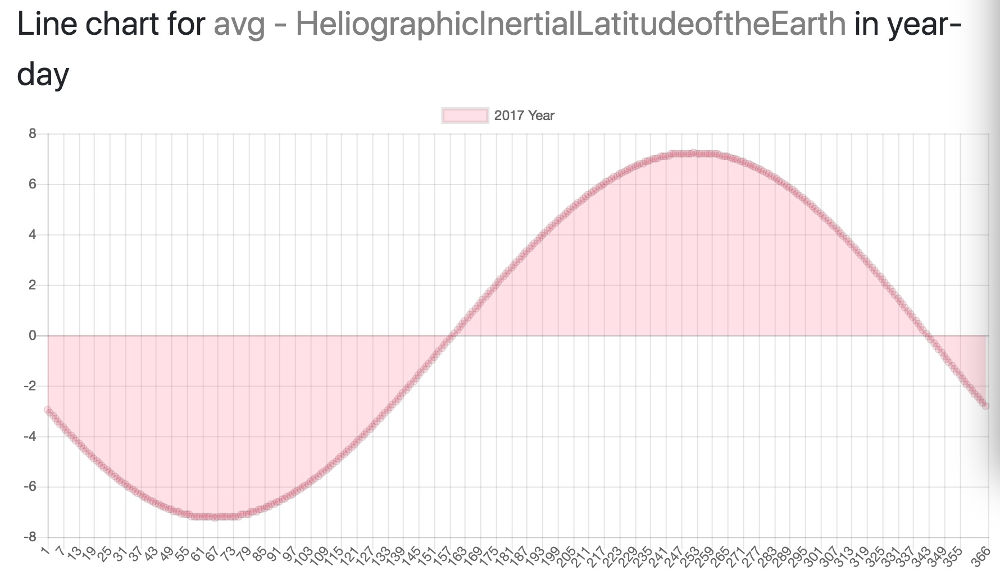
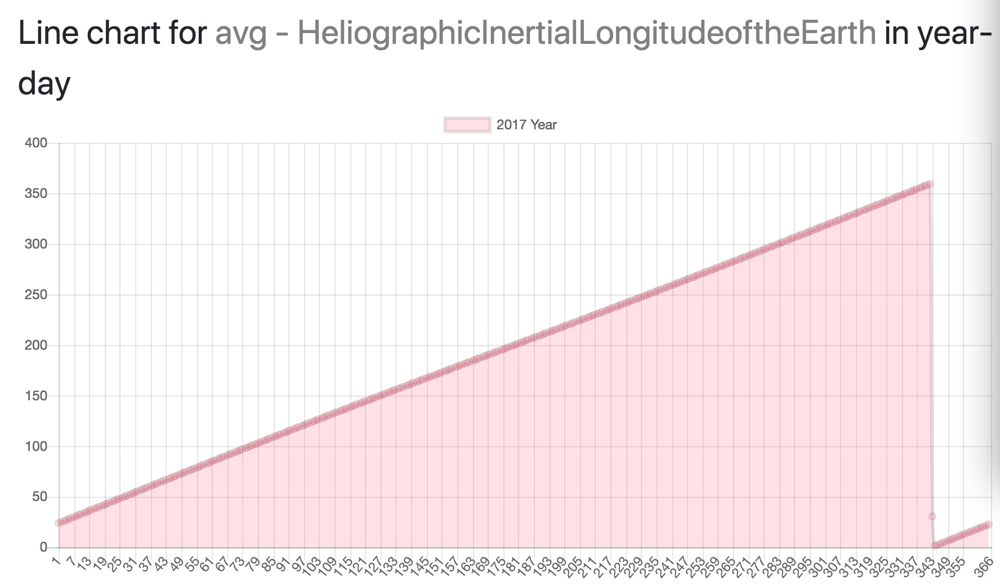

# Report on Space@VT task2 demo by Tivcrmn

## Demo Title: Analyzing Interplanetary Magnetic Field (IMF) data from OMNI. from 2011 to 2017

Description: IMF is the Sun’s magnetic field carried by the solarwind into the interplanetary space. 
IMF plays an important role in transferring energy into the Earth’s atmosphere and generating the northern lights (aurora). 
IMF data is available for download from NASA’s OMNI database. 

Students can work on a variety of demo projects using IMF. 

For example: 

1. develop a real time IMF monitoring tool. 
2. develop visualizations of IMF data.

[Data Website](https://cdaweb.gsfc.nasa.gov/pub/data/omni/)

The features which have been finished

 - Show a certain element in the canvas in some days based on hour
 - Show a certain element in the canvas in some months based on day (the number is avg, max or min of the day)
 - Show a certain element in the canvas in some years based on day or month (the number is avg, max or min of the day or month)

[Live Demo is here](http://tivarea.top/demo/client/index.html)


How to run?

``` bash
# clone the repo to your pc and cd the directory
git clone https://github.com/Tivcrmn/Space-VT-task2-demo.git

# install dependencies both on the client and server
npm install

# client run at localhost:8080 and server run at localhost:5000
npm run dev

```

### Tech Stacks


- [Vue (The Progressive JavaScript Framework)](https://vuejs.org/index.html)
- [Express (Fast, unopinionated, minimalist web framework for Node.js)](http://expressjs.com/)
- [ES6 (Modern JavaScript)](https://es6.io/)
- [MongoDB (The leading modern, general purpose database platform)](https://www.mongodb.com/)

#### IMF data in MongoDB documents 

```json
{
    "_id" : ObjectId("5a98c57828280a0e510bbeff"),
    "Year" : 2017,
    "DecimalDay" : 1,
    "Month" : 1,
    "Hour" : 0,
    "HeliographicInertialLatitudeoftheEarth" : -2.9,
    "HeliographicInertialLongitudeoftheEarth" : 23.5,
    "BR_RTN" : 5.8,
    "BT_RTN" : 0.8,
    "BN_RTN" : -2.4,
    "FieldMagnitudeAverage" : 7.1,
    "BulkFlowspeed" : 551,
    "THETA" : -0.8,
    "PHI" : -4.3,
    "IONDensity" : 6.9,
    "Temperature" : 149703,
    "__v" : 0
}
```

#### Query between Frontend and Backend

```json
{
    "element" : "Temperature",
    "timespan" : "year-month",
    "time" : "2017|2016",
    "numType": "avg" 
}
```

#### The results example from backend

```json
{
    "success": true,
    "error": null,
    "data": [
    {
        "_id": {
            "Year": 2016,
            "Month": 1
        },
        "avgNum": 96195.80510752689
    },
    {
        "_id": {
            "Year": 2016,
            "Month": 2
        },
        "avgNum": 84236.48850574713
        },
    {
        "_id": {
            "Year": 2016,
            "Month": 3
        },
        "avgNum": 102904.09005376344
        },
    ],
    ....
    "code": 0
}
```

 ### Some simple conclusions and verification based on the demo
 
 1. Heliographic Inertial Latitude of the Earth  - time should be a sin or cos 
 
 
 
 2. Heliographic Inertial Longitude of the Earth  - time should be linear function
 
 
  
 3. The Top 5 hottest day from 2011 to 2017
  
 
 
    1. 2014-13 avg: 602702.54

 

    2. 2015-178 avg: 597657.125

 
 
    3. 2017-251 avg: 544412.75

 
 
    4. 2017-250 avg: 540802

 
 
    5. 2011-149 avg: 505466

 
 
 4. The hottest moment from 2011 to 2017
 
 2017-251 2am 2850964 Really so hot!!!
 
 
 
 
 
 


